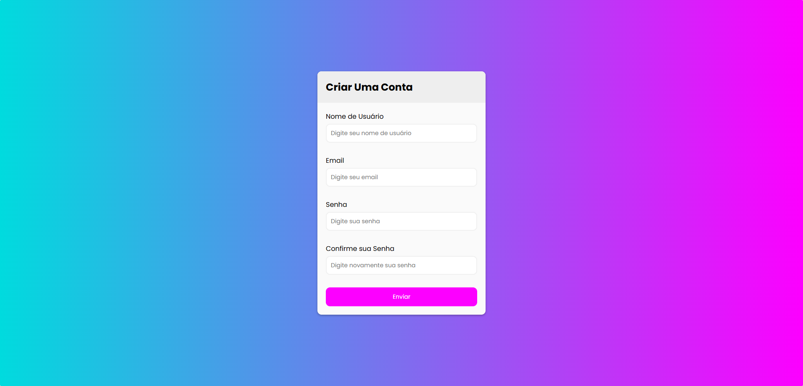

<h1 align="center"> Lista de Tarefas - FSC </h1>

<p align="center">
  <a href="#-funcionalidades">🚀 Funcionalidades</a>&nbsp;&nbsp;&nbsp;|&nbsp;&nbsp;&nbsp;
  <a href="#-demonstração">🌐 Demonstração</a>&nbsp;&nbsp;&nbsp;|&nbsp;&nbsp;&nbsp;
  <a href="#-tecnologias-utilizadas">🛠️ Tecnologias Utilizadas</a>
  <br>
  <a href="#-como-executar-localmente">📦 Como executar localmente</a>&nbsp;&nbsp;&nbsp;|&nbsp;&nbsp;&nbsp;
  <a href="#-contribuição">🤝 Contribuição</a>&nbsp;&nbsp;&nbsp;|&nbsp;&nbsp;&nbsp;
  <a href="#-licença">📄 Licença</a>
</p>

<p align="center">
  
</p>

<p align="center">
  
</p>


# 📝 Formulário FSC

Uma página simples para criação de conta com validação básica e layout responsivo.  
Acesse a versão hospedada: **👉 [Formulário FSC](https://calebemedeiros.github.io/FormularioFSC/)**

---

## Descrição

Aplicação front-end que apresenta um formulário de cadastro com campos essenciais: **nome de usuário**, **email**, **senha** e **confirmação de senha**. Ideal como componente para sites estáticos ou como exemplo didático de validação de formulários em JavaScript.

---

## 🚀 Funcionalidades

- **Campo Nome de Usuário** com placeholder e validação básica.
- **Campo Email** com verificação de formato.
- **Campo Senha** e **Confirme sua Senha** com checagem de correspondência.
- **Botão Enviar** que valida os campos antes do envio.
- **Feedback visual** para erros e sucesso.
- **Layout responsivo** para uso em dispositivos móveis e desktop.
- **Persistência opcional** via armazenamento local do navegador (se implementado).

---

## 🌐 Demonstração

Você pode testar diretamente no navegador:  
**[Formulário FSC - GitHub Pages](https://calebemedeiros.github.io/FormularioFSC/)**

---

## 🛠️ Tecnologias Utilizadas

- **HTML5**
- **CSS3**
- **JavaScript**
- **GitHub Pages** para hospedagem

---

## 📦 Como executar localmente

1. Clone o repositório:
   ```bash
   git clone https://github.com/calebemedeiros/FormularioFSC.git
   ```
2. Acesse a pasta do projeto:
   ```bash
   cd FormularioFSC
   ```
3. Abra o arquivo `index.html` no seu navegador.

---

## 🤝 Contribuição

Contribuições são bem-vindas. Siga este fluxo:

1. Faça um fork do repositório.
2. Crie uma branch para sua feature:
   ```bash
   git checkout -b minha-feature
   ```
3. Faça commits claros:
   ```bash
   git commit -m "Descrição da mudança"
   ```
4. Envie para sua branch:
   ```bash
   git push origin minha-feature
   ```
5. Abra um Pull Request no repositório original.

---

## 📄 Licença

Projeto disponibilizado sob a **licença MIT**. Sinta-se livre para usar, modificar e distribuir.

---

## 👨‍💻 Autor

Desenvolvido por **[Calebe Medeiros](https://github.com/calebemedeiros)** ✨
